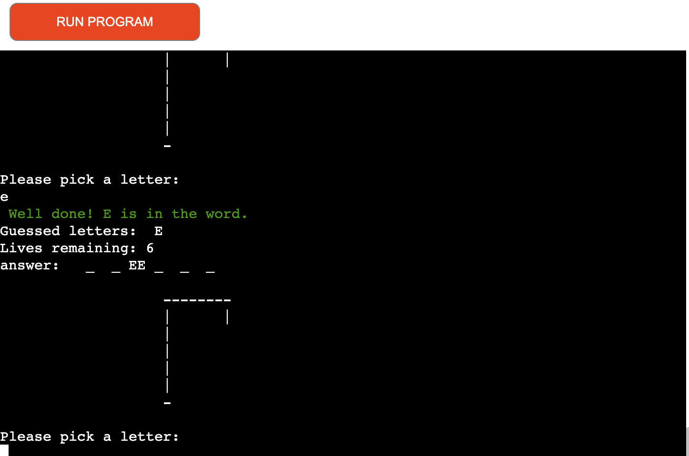
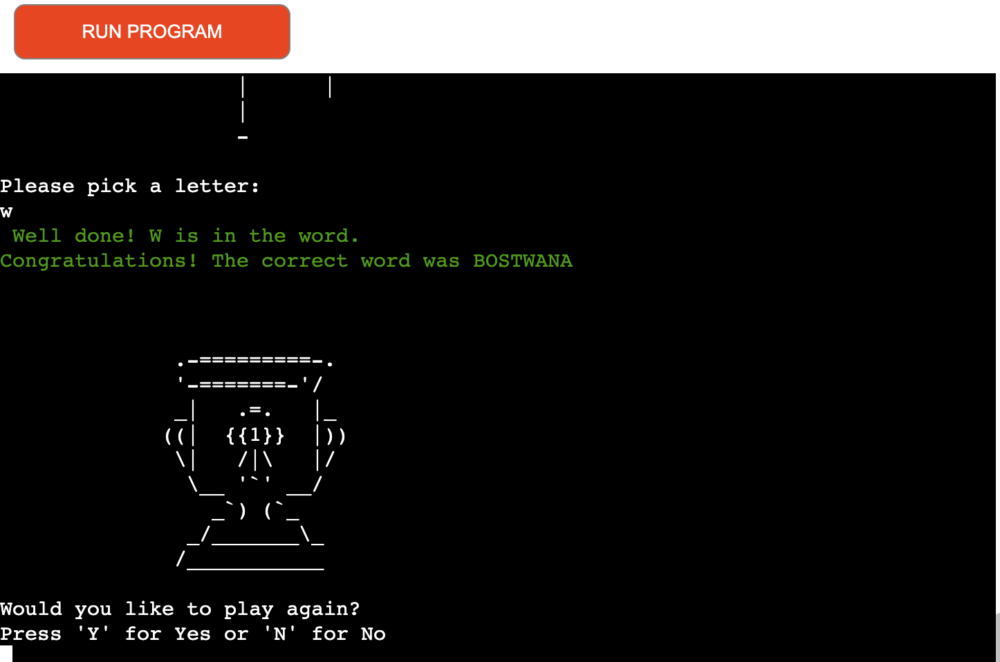

# Hangman

# The Aim of the project

 Hangman is a python terminal game, that runs on the code institute mock terminal called Heroku. The game is aimed at users who like to play a game of hangman. The game is split into 3 caterogies( Cars, Animals and Countries) and the user will have to choose which category they want to try before the game generates a random word from that category. The game will generate a random word for which the player will have 6 attempts per word before the game is declared over

# User goals

- The program should be simple to navigate
- the game should be easy 
- Expects little to no bugs
- Good response to player/user input

# Features

- Home Page/Main menu
    - Game Header
    - Option to select start of game
    - Option to read the rules of the game
    - Option to exit the game menu

- Game rule
    - Short display of the game rules which is followed by a function to return back to the menu

- Game Play 
    - to access the game, the user will have to choose option 1 at the main menu. The user will then be prompted to enter their username. A good luck message will then be displayed. A random word will then be generated for the user to guess.

- Correct Guess
    - Once the game has started, the user is then presented with the secret word to guess. The player can then see how many letters there is the word. When the player correclty guesses a letter, a message will be printed in green confirming a correct guess, followed by the empty space in the word being replaced by the correct letter. If the correct letter is appaearing twice in the word, the empty spaces will be replaced by the correctly guess letters

- Incorrect Guess
    - If a letter guessed by the user is incorrect, a message will the be printed in red confirming that the letter is indeed not in the secret word. The amount of attempts will then go down by 1, a body part will then be added to the gallows. The incorrect letter will then be added to the list of incorrect letters.

- Invalid guess
    - When the user inputs anything other than letters(number or special characters), this will genereate an error on the app (in red) confirming to the user that only letters will be accepted as guesses. This will not affect the amount of attempts left

- Game Won
    - The game is won when the user has guessed all the correct letters in the secret word. A winner message will then be revealed and the user will be presented with the option of playing again or heading back to the main menu.

 

- Game Over
    - If the player has 6 incorrect guesses, the user is hung. The secret word is then revealed and the user is then presented with the option of either playing again or going back to the main menu.

- Invalid inputs
    - For every invalid inputs, an error will be displayed on the program and the user will the be asked to input their option again

# Testing 

# Technologies used

- Languages used 
    - Python 
- Other languages used in the project were html, css and javascript. However these languages were already part of the code institute provided to create this project.

# Features to Implement In future

- Scoring sytem with the best scores displayed on the leaderboard
- Difficulty levels, this could by making words which contains up to 5 letters easy. Intermeditate levels between 6-8 and hard level for words with 8 letters and above 
- Timer could be added to the game, the timer could be set according to difficulty levels
- Divide the words into categories (i.e sports, countries, anaimals, plants & cars etc...)

# Deployment

- The site was deployed on Heroku. the steps to the deployment are listed below 
    - Login or Signup to [Heroku](https://www.heroku.com/)
    - Once signed up/ logged in - create a new app, followed by selecting a unique name and regions
    - click on "create app" 
    - Click on "settings"
    - Then Click on "reveal config vars"
    - The following will need to be inputed, otherwise you could face issues during deployemnt
        - Key:PORT, Value:8000
    - Once that is done, select buildpacks, then select python and click save
    - Once again, select buildpacks, but this time, select Nodejs and then click save again
    - Ensure that buildpacks are in this order (Python then Nodejs)
    - Once that is done, navigate to "Deploy" tab. Select GitHub as the deployment method and connect to GitHub and select your chosen repository to connect.
    - You have the option to select "deploy automatically", which will automatically deploy whenever you push to GitHub. The second option is to manually deploy.
    - Once you have selected your option, Heroku will then deploy

# Credits

- the visuals for the hangman stages were taken from this video [Kite](https://www.youtube.com/watch?v=m4nEnsavl6w)
- A lot of my game function drew inspiration from this tutorial [youtube](https://www.youtube.com/watch?v=cJJTnI22IF8)
- My Word art at the start of the game was generated from this website [ASCII Art Generator](https://patorjk.com/software/taag/#p=display&h=1&f=Doom&t=Hangman)
- For further help with my game functions[Kylie Ying](https://www.youtube.com/watch?v=cJJTnI22IF8)
- the clear screen function was taken from this site [Clear screen](https://www.geeksforgeeks.org/clear-screen-python/)
- The tropy design was taken from this site [Trophy](https://ascii.co.uk/art/trophy)
- the colors introduced on the app was inspired by this site[Colorama](https://www.geeksforgeeks.org/introduction-to-python-colorama/)